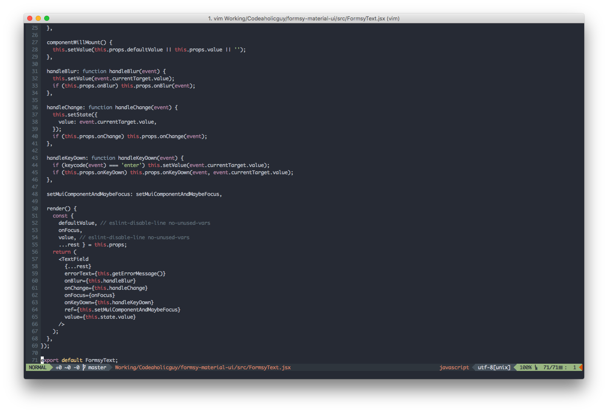

# dotfiles
My set of `vim`, `zsh`, and `tmux` configuration files JavaScript Developer.

Install
-------

Clone onto your machine:

    git clone git://github.com/codeaholicguy/dotfiles.git

Simply run file:

    ./install.sh

In `vim/neovim` run:

    :PlugInstall

If you want to get newest version of `vim/neovim` plugin, in `vim/neovim` simply run:

    :PlugUpdate

### Notice

- Remember to update the font of iTerm to Powerline fonts.
- Remember to run `eslint .` and install all lacked modules `npm install --global ${name}`.

Credit
-------

Thanks to:

https://github.com/powerline/fonts
https://github.com/dracula/dracula-theme/

